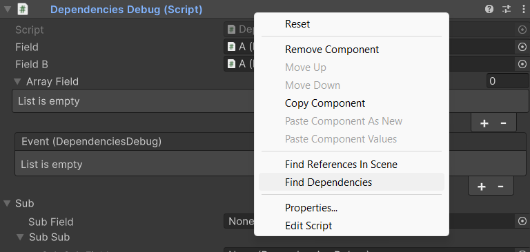
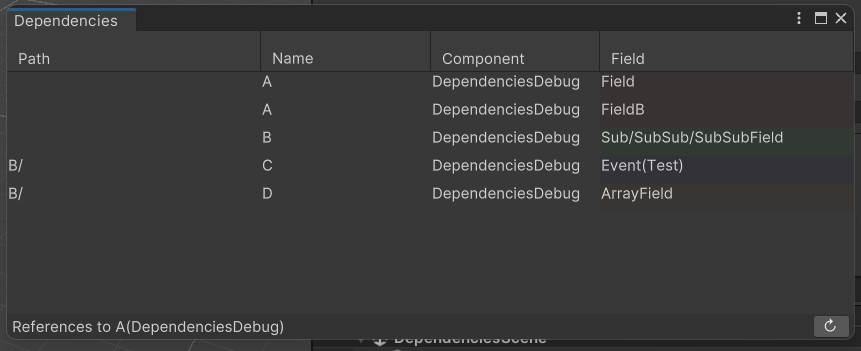

# Softleities

Softleitner Utilities for Unity  
Minimum Unity Version: 2022.3

## Contents

### Dependencies Window

This custom editor window displays references to the selected component. This includes field and events that call it.

Right click the top of any component in the inspector and choose Find Dependencies.

The resulting window shows any other components that has a reference.

The window can be sorted by any of the fields. Click an entry to ping the component or double click it to select it in the inspector.

## Install

- Open the __Package Manager__ window
- Click + and select ___Add package from git URL...___
- Enter __https://github.com/Schossi/Softleities.git__

## Development

- Create a new project using Unity 2022.3
- Place Softleities Repo inside Assets folder

## License

MIT License

Copyright © 2024 SoftLeitner
